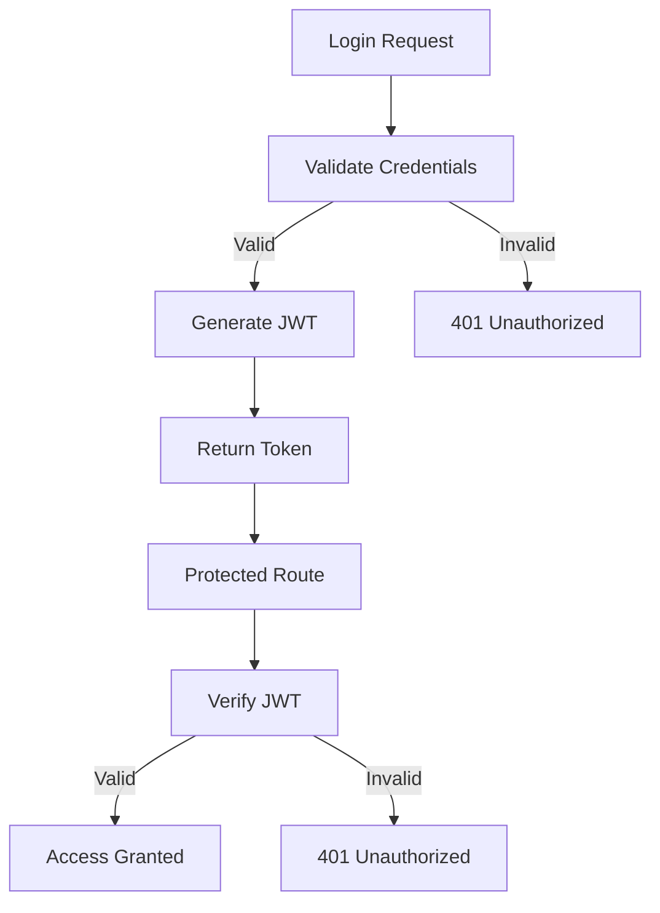

# GateKeeper 🔐

GateKeeper is a JWT-based authentication system built with Node.js and Express. It demonstrates how authentication and route protection work by generating signed JSON Web Tokens (JWT) and verifying them before granting access to protected resources.

---

# Tech Stack

<p align="center">
  
  
  
  
</p>

---

## Features

* User login authentication
* JWT token generation
* Protected route authorization
* Token verification middleware
* Invalid credential and token handling

---

## Authentication Flow




---

## API Endpoints

| Method | Endpoint                    | Description                              |
| ------ | --------------------------- | ---------------------------------------- |
| POST   | `/api/v1/gatekeeper/login`  | Authenticate user and receive JWT token  |
| GET    | `/api/v1/gatekeeper/access` | Access protected route using a valid JWT |

---

## Demo Users

| Username | Password |
| -------- | -------- |
| rudra    | rudra001 |
| tria     | tria001  |
| kriva    | kriva001 |

---

## Sample Login Request

```http
POST /api/v1/gatekeeper/login
Content-Type: application/json
```

```json
{
  "username": "rudra",
  "password": "rudra001"
}
```

### Successful Response

```json
{
  "token": "your_jwt_token"
}
```

---

## Concepts Practiced

* Express routing and middleware
* JWT authentication and authorization
* Request headers and protected routes
* Error handling and environment variables

---

## Future Improvements

* User registration endpoint
* Password hashing with bcrypt
* MongoDB integration
* React frontend dashboard

---

## Learning Goal

The purpose of this project was to understand authentication from first principles by implementing JWT login, token verification, and route protection manually instead of relying on third-party authentication providers.

---

Built while learning backend development and authentication fundamentals 🚀
